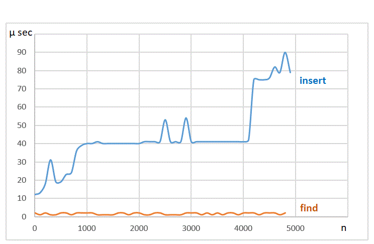

# C++ key-value pairs for Arduino (ESP boards)


This is an in-memory key-value pairs library. If you are looking for a persistent�(disk) key-value storage, please take a look at�[https://github.com/BojanJurca/Arduino-Esp32-key-value-database](https://github.com/BojanJurca/Arduino-Esp32-key-value-database).

Internal storage is implemented as balanced binary search for good searching performance. Error handling (like running out of memory, etc) is also supported. 


Checking for an error of each function call:

```C++
    keyValuePairs<int, String>::errorCode e = kvp3.insert ( {9, "nine"} );
    if (e == kvp3.OK)
        Serial.println ("insert succeeded");
    else
        Serial.println ("insert error " + String (e));
```

Checking for errors of multiple operations:

```C++
    for (int i = 1000; i < 1100; i++)
        kvp3.insert (i, String (i));
    if (kvp3.lastErrorCode == kvp3.OK)
        Serial.println ("100 inserts succeeded");
    else {
        Serial.println ("100 inserts error " + String (kvp3.lastErrorCode));
        kvp3.clearLastErrorCode (); // clear lastErrorCode before next operations
    }
```

Checking for a success of iteration. How can iteration fail in the first place? At the beginning of iteration an internal stack needs to be created in order to iterate through a balanced binary search tree. If there is not enough memory available for the internal stack, the iteration would fail:

```C++
    for (auto pair: kvp3)
        Serial.println (String (pair.key) + "-" + String (pair.value));
    if (kvp3.lastErrorCode != kvp3.OK) Serial.println ("keyValuePair iteration error " + String (kvp3.lastErrorCode));
    kvp3.clearLastErrorCode (); // clear lastErrorCode before next operations
```

## Some thoughts and numbers

### How many key-value pairs can reside in the controller's memory?

Well, it depends, but if we make some assumptions we can give some answers. Say keyValuePairs is running on ESP32 with a partition scheme having 1.2 MB app memory and relatively small key-value pairs of 16 bit integer keys and 32 bit integer values. Then up to 7700 key-value pairs can fit into the controller's heap memory.

keyValuePairs uses 30 extra bytes for each pair it contains, to maintain balanced binary tree structure. Memory efficiency is thus low, only 6 out of 36 bytes (17 %) hold useful information. But if more complex data types are used for storing values, like short Strings for example, each key-value pair would use more memory so memory efficiency would improve (to some 37 %) but the total number of pairs that fit into memory would go down to some 5700.

### How fast the insert and find operations are?

Time complexity of a balanced binary search tree can be estimated by O (log n), where n is the number of key-value pairs already in the tree. With an increasing number of pairs we can expect that operation time would also increase but very slowly. As we have seen, n doesn't get very high, having only a small memory of the controller. Here are some measurements:




